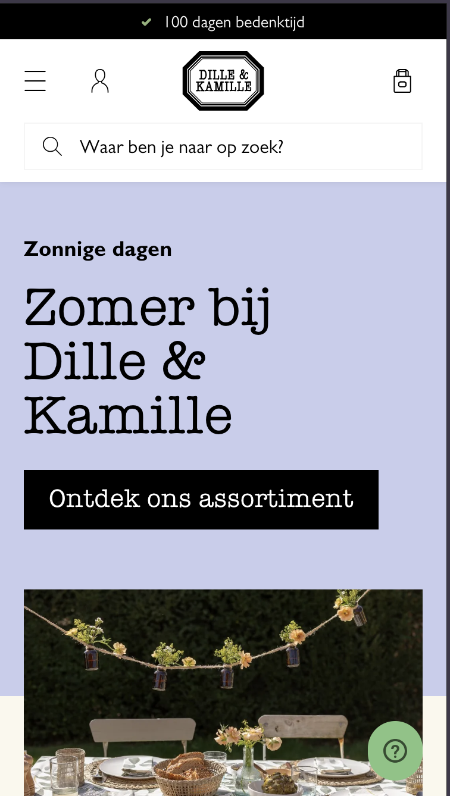
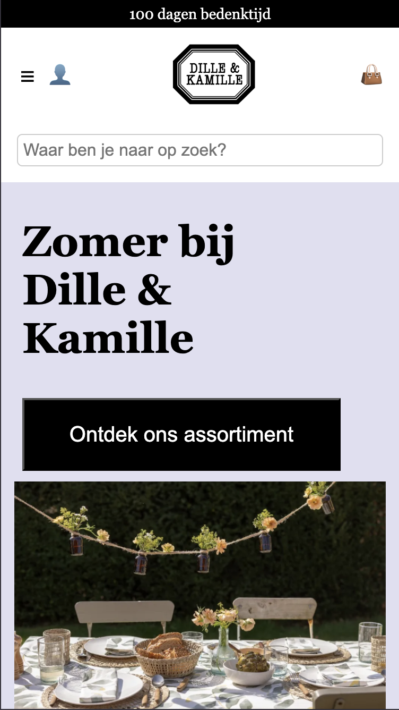
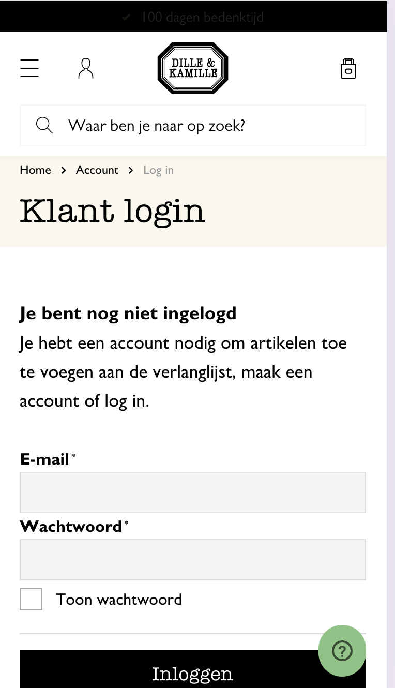
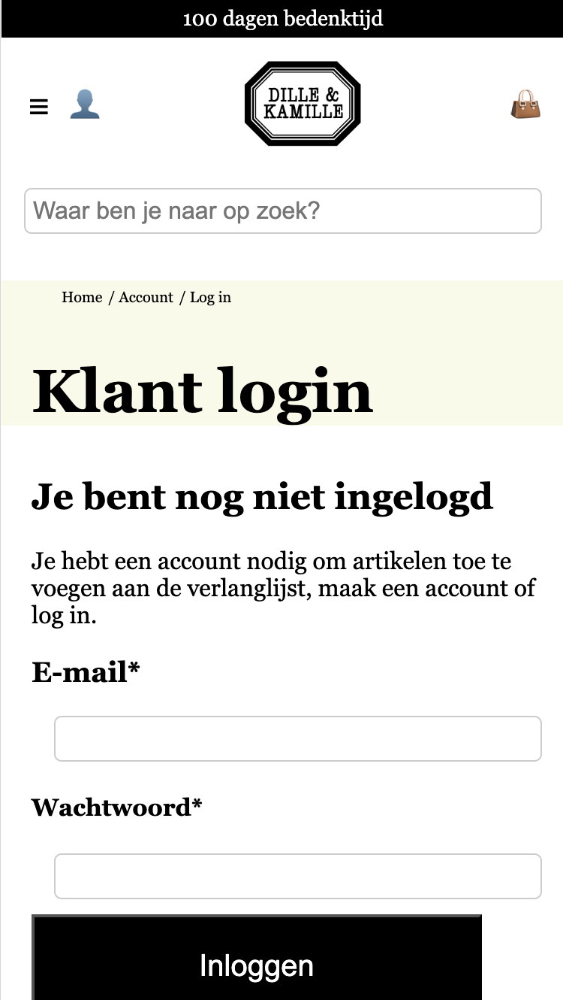
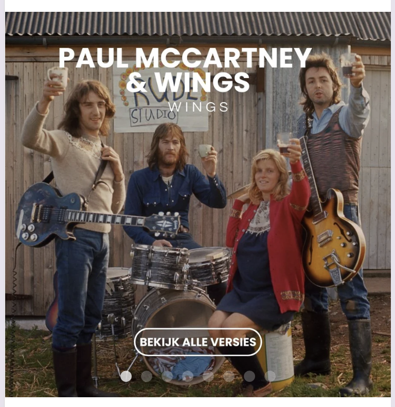
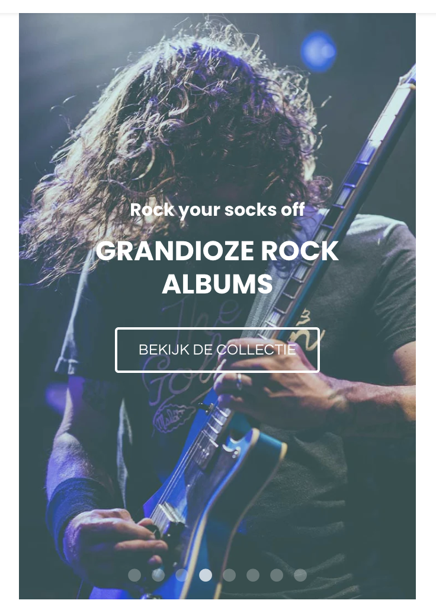

# Procesverslag
Markdown is een simpele manier om HTML te schrijven.  
Markdown cheat cheet: [Hulp bij het schrijven van Markdown](https://github.com/adam-p/markdown-here/wiki/Markdown-Cheatsheet).

Nb. De standaardstructuur en de spartaanse opmaak van de README.md zijn helemaal prima. Het gaat om de inhoud van je procesverslag. Besteedt de tijd voor pracht en praal aan je website.

Nb. Door *open* toe te voegen aan een *details* element kun je deze standaard open zetten. Fijn om dat steeds voor de relevante stuk(ken) te doen.

## Jij

  
uitwerken voor kick-off werkgroep

  ### Auteur:
  Julissa Buiten (vervangen door jouw naam)

  #### Je startniveau:
  Rood (kies uit zwart, rood óf blauw)

  #### Je focus:
  Surface plane (kies uit responsive óf surface plane)
 

## Je website

  
uitwerken voor kick-off werkgroep

  ### Je opdracht:
  link naar de website die je gaat namaken óf de naam/omschrijving van je eigen ontwerp

  #### Screenshot(s) van de eerste pagina (small screen): 
  Homepagina van Dille & kamille nagemaakt.
  
  
  #### Screenshot(s) van de tweede pagina (small screen):
 Log in pagina Dille & Kamille 
  
  
 

## Toegankelijkheidstest 1/2 (week 1)

  
uitwerken na test in 2e werkgroep

  ### Bevindingen
  Lijst met je bevindingen die in de test naar voren kwamen:
  Test 1 screenreader platenzaak.nl:
  Hij benoemd hoe veel procent de pagina is geladen. Zonder dat ik wat doe wordt de pagina helemaal voorgelezen. Sommige alt teksten zijn heel uitgebreid en lezen de link voor, terwijl dat niet nodig is. Engelse tekst word door een andere stem gesproken. Hij spreekt de hele carousel uit in plaats van de gene die je als eerste ziet. De afbeeldingen van de producten bevatten dezelfde alt tekst als de beschrijving.

 
## Breakdownschets (week 1)

  
uitwerken na afloop 3e werkgroep

  ### de hele pagina: 
  

  ### dynamisch deel (bijv menu): 
  

## Voortgang 1 (week 2)

  
uitwerken voor 1e voortgang

  ### Stand van zaken
  hier dit ging goed & dit was lastig (neem ook screenshots op van delen van je website en code)
  Ik was hier begonnen met mijn html op basis van mijn breakdown schets. Waar ik tegen aan liep is dat je de iconen niet kan downloaden via google chrome. Dus die zal ik moeten namaken. Het ging goed om alle stukjes over te nemen, wel zijn sommige dingen op de website verschillend opgebouwd. bijvoorbeeld bij deze afbeelding  is het 1 afbeelding, de button en tekst bevind zich in een img en dat is een link. Maar als je dan kijkt naar mijn tweede pagina is het anders.  Hierin heb je de afbeelding los, maar ook de tekst en de button. 

  ### Agenda voor meeting
  samen met je groepje opstellen

  | Julissa     | student 2          | student 3    | student 4        |
  | ---            | ---                | ---          | ---              |
  | Errors?  | en dit             | en ik dit    | en dan ik dat    |
  | of ik alle content er al in moet zetten als ik een carousel wil doen | dit als er tijd is | nog een punt | dit wil ik zeker |
  |Product details?          | ...                | ...          | ...              |

  ### Verslag van meeting
  hier na afloop snel de uitkomsten van de meeting vastleggen

  - antwoord op mijn vraag: gebruik de caroussel oefening van de flexbox opdrachten.
  - Voor een dropdown details gebruiken.
  - Voor de product details tabel gebruiken, Table heading voor de titels van de items. 

## Voortgang 2 (week 3)

  
uitwerken voor 2e voortgang

  ### Stand van zaken
  hier dit ging goed & dit was lastig (neem ook screenshots op van delen van je website en code)

  ### Agenda voor meeting
  samen met je groepje opstellen

  | student 1      | student 2          | student 3    | student 4        |
  | ---            | ---                | ---          | ---              |
  | vragen over mijn afbeelding die niet mee werkt  | en dit             | en ik dit    | en dan ik dat    |
  | | dit als er tijd is | nog een punt | dit wil ik zeker |
  | ...            | ...                | ...          | ...              |

  ### Verslag van meeting
  hier na afloop snel de uitkomsten van de meeting vastleggen

  - Voor knoppen die je naar een andere pagina verwijzen gebruik je een anchor (a) element ipv button
  - Een input element heeft een label nodig voor de toegankelijkheid, check onderstaande bron met voorbeeld. Er is ook een hidden label trucje wat je kunt gebruiken als er niet perse tekst bij hoeft.
  - Gebruik custom properties, dit is een van de surface plain dingen waarvan je er 5 moet hebben.
- Gebruik in je CSS consisstent een soort unit(px of em of % bvb)
 

## Toegankelijkheidstest 2/2 (week 4)

  
uitwerken na test in 9e werkgroep

  ### Bevindingen
  Lijst met je bevindingen die in de test naar voren kwamen (geef ook aan wat er verbeterd is):
  Screenreader test:
  Alle alt teksten worden goed benoemd. De banner word benoemd als banner. En daarna de items erin. Bij de header benoemt die de favorieten en het winkelmandje dubbel. Dus daar zou ik naar moeten kijken. Er word goed benoemd welke elementen een knop is. Bij sommige onderdelen ben ik de alt text vergeten dus daar moet ik dat nog toevoegen. Deze noemt die als ongelabelde afbeelding wel word er gezegd dat je het context menu kan openen voor meer informatie. In de footer moet ik de social media alt text verbeteren, hij leest alleen platenzaak.nl op maar niet de soort social media.

## Voortgang 3 (week 4)

  
uitwerken voor 3e voortgang

  ### Stand van zaken
  Ik liep tegen het vormgeven van de sections aan, de tekst versprong de hele tijd en het stond net niet hoe ik wou.

  ### Agenda voor meeting
  samen met je groepje opstellen

  | student 1      | student 2          | student 3    | student 4        |
  | ---            | ---                | ---          | ---              |
  | dit bespreken  | en dit             | en ik dit    | en dan ik dat    |
  | en dat ook nog | dit als er tijd is | nog een punt | dit wil ik zeker |
  | ...            | ...                | ...          | ...              |

  ### Verslag van meeting
  hier na afloop snel de uitkomsten van de meeting vastleggen
  Ik ben niet bij deze feedbacksessie geweest
  - punt 1
  - punt 2
  - nog een punt
  - ...

## Eindgesprek (week 5)

  
uitwerken voor eindgesprek

  ### Je uitkomst - karakteristiek screenshots:
  

  ### Dit ging goed/Heb ik geleerd: 
  Ik heb geleerd hoe ik caroussels moet maken, dit heb ik ook het meeste moeten toepassen. Daarnaast heb ik ook geleerd om search bars te maken en om < details >  toe te passen. En ook met de surface plane heb ik geleerd hoe ik dark mode toepas, de tekst groter maak en hoe ik onderdelen vergoot wanneer je hovert.

  

  ### Dit was lastig/Is niet gelukt:
  Ik wou heel graag mijn hamburger menu nog uitwerken maar dit is mij niet gelukt. Ik was bezig met een UL en met Javascript maar er gebeurde niks. Daarnaast had ik ook veel moeite met de bolletjes en pijltjes toevoegen aan de carousels. Ik had de tutorial gevolgd van flexbox oefening 4 maar de code  scroll-marker-group: after; gaf aan dat die niet bestond dus daar liep ik vast, ik heb het wel op een andere manier bij mijn eerste en tweede carousel toegepast. maar dat was meer met javascript en ik wist ook niet hoe ik dat op meerdere carrousels kon aanpassen.
  Het was ook niet gelukt om de product foto viewer te doen zie hieronder de afbeelding, eigenlijk om dezelfde reden, de code bestaat niet. Wel had ik die exctentie aangevinkt in chrome maar dat heeft niks veranderd.
  

  

## Bronnenlijst

  
continu bijhouden terwijl je werkt

  Nb. Wees specifiek ('css-tricks' als bron is bijv. niet specifiek genoeg). 
  Nb. ChatGpT en andere AI horen er ook bij.
  Nb. Vermeld de bronnen ook in je code.

  1. /*https://www.w3schools.com/howto/howto_js_accordion.asp*/
  2. /*https://www.w3schools.com/howto/howto_css_image_text.asp*/
  3. //https://www.w3schools.com/howto/howto_js_toggle_dark_mode.asp

